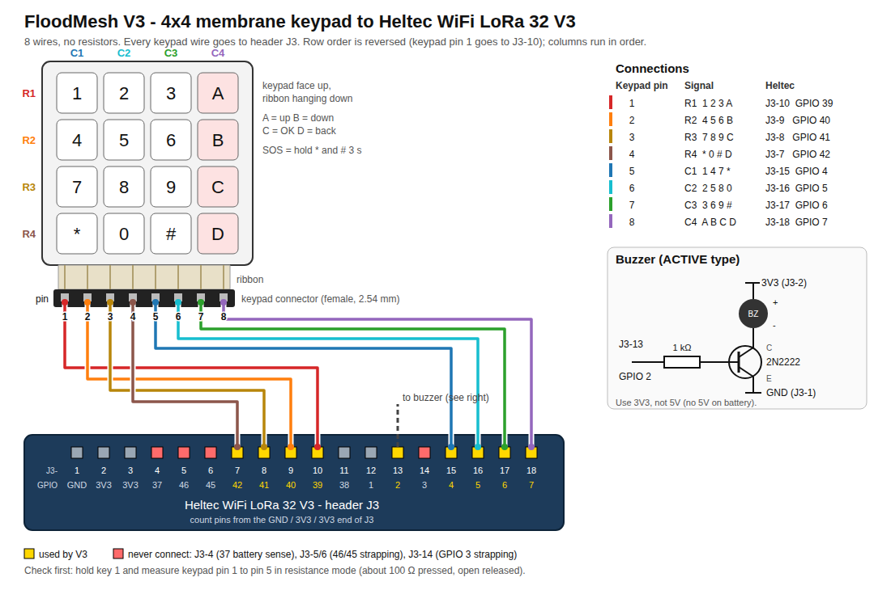

# FloodMesh firmware V3: keypad + buzzer field-test build

A separate firmware for field tests of **range, relaying, texting and SOS**.
The only hardware is a **Heltec WiFi LoRa 32 V3/V3.2, a 4×4 membrane keypad
and an active buzzer**. There is no voice, no MCP23017, no mic, speaker or
side button.

The original firmware in the repository root (`src/`, `include/`,
`platformio.ini`) is not changed by this build. V3 is its own PlatformIO
project in this folder.

```
pio run -d firmware_v3 -e v3               # build
pio run -d firmware_v3 -e v3 -t upload     # flash
pio device monitor -b 115200               # serial console
```

CI builds it too: the `firmware-v3` artifact of `.github/workflows/build.yml`.

## 1. Wiring

The keypad goes **straight to the Heltec GPIOs** (8 wires). The buzzer needs
one transistor.



(`docs/keypad-wiring.svg` is the same diagram as a vector file. Regenerate it
with `python3 tools/gen_wiring_svg.py`.)

**Check the keypad before soldering.** Use the meter's **resistance** mode,
not the continuity beep. A pressed membrane key reads about 50–500 Ω, and
many meters only beep below about 30 Ω. Hold key 1 and measure keypad pin 1
to pin 5. Do the same for key 5 (pins 2 and 6), key 9 (3 and 7) and key D
(4 and 8). Push male jumper pins into the connector to probe it.

| Keypad pin (left → right on the ribbon) | Signal | Heltec GPIO |
|---|---|---|
| 1 | ROW1 (1 2 3 A) | **39** |
| 2 | ROW2 (4 5 6 B) | **40** |
| 3 | ROW3 (7 8 9 C) | **41** |
| 4 | ROW4 (* 0 # D) | **42** |
| 5 | COL1 (1 4 7 *) | **4** |
| 6 | COL2 (2 5 8 0) | **5** |
| 7 | COL3 (3 6 9 #) | **6** |
| 8 | COL4 (A B C D) | **7** |

- Most 4×4 membrane keypads have rows on pins 1–4 and columns on pins 5–8,
  but not all. A wrong layout shows up at once: type on the compose screen
  and check the letters. Fix it by changing the wire order; no firmware change
  is needed.
- There are no external resistors. The columns use the ESP32 internal
  pull-ups. Rows are driven LOW one at a time and left floating otherwise, so
  two keys pressed together can never short two outputs.
- Columns are on GPIO 4–7 because these are RTC pins. A later deep-sleep build
  can wake on any key press.

**Buzzer (ACTIVE type, one with a built-in oscillator):**

```
GPIO 2 ──[1 kΩ]── 2N2222 base
                  2N2222 emitter ── GND
                  2N2222 collector ── buzzer (−)
                  buzzer (+) ── 3V3
```

Use 3V3, not 5V: 5V is only present on USB and the unit would go silent on
battery. A passive buzzer only clicks with this firmware.

Other pins in use: OLED 17/18/21, Vext 36, LoRa 8–14, battery sense 1/37,
LED 35. The pin map with its compile-time conflict checks is
`include/floodmesh_pins.h`.

## 2. Keys

```
 1  2  3  A        A = up / previous
 4  5  6  B        B = down / next
 7  8  9  C        C = OK   (hold = send)
 *  0  #  D        D = back / delete
```

| Where | Key | Action |
|---|---|---|
| Anywhere | hold **\*** and **#** together 3 s | **SOS** (bar fills; release early to cancel) |
| Home | 0–9 | start a text (that key is typed) |
| Home | A | alerts menu: SAFE, WATER GND FLOOR, NEED EVACUATION, NEED MEDICAL |
| Home | B | status and range test |
| Home | C | inbox |
| Compose | 2–9 | letters (T9 predicts the word) |
| Compose | 0 | space (accepts the T9 word) |
| Compose | 1 | punctuation `. , ? ! - ' /` (tap repeatedly) |
| Compose | \* | next T9 word |
| Compose | # | mode: T9 → ABC (multi-tap, for Tanglish) → 123 |
| Compose | A / B | previous / next T9 word |
| Compose | C | accept the word; **hold C = send** |
| Compose | D | delete; on an empty text, leave. **Hold D = discard** |
| Inbox | A / B, C, D | scroll, open, back |
| Alerts | A / B, **hold C**, D | choose, send, back |
| Status | A / B, C, D | scroll the heard list, range-test ping on/off, back |

A key press while the screen is blank only wakes it. A key press on a
popup only dismisses it. A received SOS beeps for about a minute, or until a
key is pressed.

Texts are up to 60 characters: `A–Z 0–9`, space and
`. , ? ! - ' / : ; ( ) + @ # * = & % " _ < > $ ~ [ ]`. Lower case is shown in
upper case.

**Boot combinations** (hold while powering on or pressing RST):

- hold **#**: BLE provisioning with the FloodMesh Admin app (roles:
  civilian / relay / responder, the same protocol as prototype v2);
- hold **\*** and **0** for 10 s: factory reset (role, keys, call sign).

## 3. Testing with it

**Sent messages show whether they were passed on.** Every unit relays (up to 3
hops). When your unit hears its own message relayed by a neighbour, the inbox
entry shows `passed on: <dBm> SNR <x>`. This is the only delivery signal:
there are no end-to-end acknowledgements.

**Range-test ping** (Status → C, or `ping on` on serial): the unit sends
`PING <n> B<battery%>` every 30 s. Receivers do not put pings in the inbox.
They update the heard list (call sign, hops, RSSI, SNR, age, count) and give a
short blip, so you can walk away with one unit and listen for the blips.

**Serial log.** Every received frame prints one line you can paste into a
spreadsheet:

```
RXLOG,<ms>,<ALARM|TEXT>,<from>,<msgId>,<hops>,<rssi>,<snr>,<text>
```

`hops` is 0 when heard directly and 1 or more when it came through relays.
Other log lines: `[MESH] relayed ...`, `[ECHO] our text msg N relayed by a
neighbour`, `[MESH] ... FAILED authentication` (a different PSK),
`[MESH] text REFUSED - duty cycle` (the 2.5% budget is spent).

**Serial commands:** `help`, `info`, `prov`, `alarm <0-4>` (0 SAFE,
1 MEDICAL, 2 WATER, 3 EVACUATE, 4 SOS), `text <message>`,
`ping on` / `ping off`, `heard`.

Suggested test plan:

1. **Bench:** 3 units on a table. Send a text from A. B and C must show it
   with `0 hop`. A's inbox entry must show `passed on`.
2. **Line of sight:** ping on at A, walk B away until the blips stop. Log the
   last RSSI/SNR. At SF7/BW125 the floor is about SNR −7.5 dB.
3. **Relay chain:** A and C out of range of each other, B in the middle. A
   text from A must reach C with `1 hop`. B's status screen shows the relay
   count going up.
4. **Indoors/flood-like:** units on different floors and inside concrete.
5. **Duty cycle:** ping plus manual texts for an hour. The status line
   `air x.x%` must never pass 2.5%, and texts must be refused, not sent, when
   it does.

## 4. On air

| Frame | Type | Length | Airtime at SF7/BW125 |
|---|---|---|---|
| Alarm (SAFE…SOS) | 0x01 | 22 B | ~65 ms |
| Text, 60 chars | 0x03 | 67 B | ~131 ms |

A text packs 6 bits per character (60 chars → 45 bytes) behind a 14-byte
header and an 8-byte HMAC-SHA256 tag from the shared PSK. It has a replay
counter, like alarms. The alarm frame is unchanged from the original firmware,
so V3 and root-firmware units with the same PSK hear each other's alarms.
Units running the original firmware ignore texts.

Relaying is the same managed flooding as the original: a unit that hears a
**weaker** copy waits **less** before relaying it. A unit that hears a
neighbour relay first drops its own copy. Alarms go in an earlier contention
band than texts.

## 5. Radio wake-up: can a packet wake a sleeping Heltec?

**Yes, the hardware supports it.** V3 is always on for now, so every unit
can relay. My estimate is roughly 45–50 mA (ESP32 idle, SX1262 receive and
the OLED). It has not been measured yet. Wake-on-radio is the next step.

- The SX1262's DIO1 interrupt goes to **GPIO 14**, which is an RTC pin. The
  ESP32-S3 can deep-sleep (about 10–20 µA for the chip itself) with an
  `ext1` wake on GPIO 14 and on the keypad columns (GPIO 4–7). The radio
  stays powered and listening.
- The SX1262 in continuous receive draws about **5 mA** (with RX boost
  about 6.5 mA). With the radio's own **RX duty-cycle mode** it listens in
  short bursts and sleeps in between. The average can drop to around
  **1 mA**, but the sender's preamble must be long enough to span one sleep
  period. Today the preamble is 16 symbols (about 16 ms at SF7). A duty-cycled
  receiver needs a longer preamble on every frame, which costs airtime.
- **Catch:** an ESP32 deep-sleep wake is a reboot. The firmware must detect
  "woke by DIO1", must **not** reset the SX1262, and must read the packet
  out of its buffer first. RadioLib's `begin()` resets the chip by default,
  so this needs a small change to `fm_radio.cpp`.
- The Heltec board itself draws a few mA in sleep from its regulator and
  battery divider, so real sleep numbers must be measured.
- **Trade-off:** a sleeping unit still wakes for every frame it hears, and in
  a busy mesh that can be often. That is why the architecture has a shared
  listening window and battery-based relay volunteering
  (`docs/architecture.md`).

Suggested order: (1) measure the always-on current of V3 on a real unit,
(2) add keypad wake plus timed sleep for civilian units, (3) add DIO1 wake
with continuous RX, (4) try RX duty-cycle mode with a longer preamble and
compare the delivery rate.

## 6. What V3 does not do (yet)

- Responder signatures on messages: roles are provisioned and shown on the
  screen (CIV / RLY / RSP), but texts are signed only with the shared PSK.
- Direct (one-to-one) texts: every text goes to everyone.
- End-to-end acknowledgements and retries: the "passed on" tick only proves
  the first hop.
- Sleep: see §5.
- The duty-cycle exemption for alarms is still in place. See
  `docs/architecture.md` §1.1.
