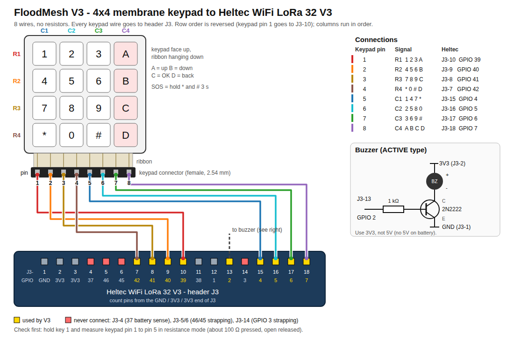

# FloodMesh firmware V4: SOS channels, responders, powered units, radio wake

V4 is the next field-test firmware after V3. It puts the architecture decisions
of 27 September 2026 (`docs/architecture.md` §13) onto the same hardware as V3:
a **Heltec WiFi LoRa 32 V3/V3.2, a 4×4 membrane keypad and an active buzzer**.
The wiring is unchanged from V3. There is no voice, no MCP23017, no mic,
speaker or side button.

`firmware_v3/` is kept as it was, for comparison tests. The root firmware
(`src/`, `include/`) is not changed by this build either.

```
pio run -d firmware_v4 -e v4               # build
pio run -d firmware_v4 -e v4 -t upload     # flash
pio device monitor -b 115200               # serial console
```

CI builds every env: the `firmware-v4`, `firmware-v4_sf9` and `firmware-v4_wake`
artifacts of `.github/workflows/build.yml`.

| Env | Radio | Use |
|---|---|---|
| `v4` | SF7, 16-symbol preamble | Default. Hears V3 units' SOS and texts |
| `v4_sf9` | SF9, 16-symbol preamble | The spreading-factor field test (§13.7) |
| `v4_wake` | SF7, 512-symbol (~0.5 s) wake-up preamble, RX duty cycle on battery | The radio-wake experiment (§13.1) |

**Every unit in one test must run the same env.** The spreading factor and
the preamble decide who can hear whom.

**Status (2026-09-27):** compiles in CI; not yet run on a unit. The first bench
test in §5 checks the new behaviour on real hardware.

## 1. What changed from V3

| Decision (`docs/architecture.md`) | V4 behaviour |
|---|---|
| No civilian presets (§7.1) | The A alerts menu is gone |
| SOS channels (§13.8) | After the `*` + `#` hold, a channel screen: 1 Medical, 2 Evacuation, 3 Hazard, 4 Food supply, 0 General. General goes out by itself after 5 s; D cancels |
| SOS for responders only (§13.4) | Civilian units forward an SOS silently: nothing on screen, no buzzer. Responder units show it and sound the buzzer |
| Responder channel filter (§13.8) | Tabs per channel, selection kept in flash, dot + inverted label on an unselected tab holding an unopened SOS, General always selected |
| Delivery ACK and "Help coming" (§13.8) | A responder unit acknowledges every SOS it receives (one per area, by a delay race). "Help coming" is a one-key reply |
| Escalation (§13.8) | An SOS in an unselected channel that nobody answers with "Help coming" within 15 min alarms every responder unit that has it |
| SOS retries (§7.6) | The sender retries after 1, 2, 4, 8, then every 15 min until an ACK arrives. The limit is still open; 24 h is a placeholder |
| No relay role (§13.2) | A unit on external power stays awake and forwards everything. The admin app's "relay" role is treated as civilian |
| Forwarding rules (§13.3) | Every unit forwards SOS, ACKs and heartbeats. A battery unit forwards a text only if it has not heard a powered unit directly in the last 65 min |
| Heartbeat (§13.5) | A powered unit sends one every 30 min; every unit forwards it; the status screen lists powered units and how long ago each was heard |
| Radio wake (§13.1) | A battery unit light-sleeps when idle; a received packet (DIO1) or a key press wakes it within about a millisecond |
| One SF, chosen by field tests (§13.7) | SF is a build setting; the relay contention slot and the listen-before-talk slot now follow it |
| Rollback (§13.6) | A newly installed image stays on trial until it has run 60 s with a working radio; otherwise the bootloader returns to the old one |
| Relay race weighting (§4.4) | The relay delay now adds a term for the unit's own battery (external power counts as full) |

Not in V4, because they need more than firmware:

- **Bluetooth firmware updates with signed images** (§13.6). The protocol has
  to be written into `docs/ble-provisioning-protocol.md` first, then the
  Flutter app and the unit. V4 keeps V3's WiFi update mode as a bench tool,
  now with rollback.
- **Presetting a responder's channels from the admin app** at registration
  (§13.8). Same reason: a protocol change. Responders pick channels on the unit.
- **The PCB changes** (§9): power-good pin, DIO1 on IO19, keypad wiring.
- **Open decisions**, left as they are: the battery floor for forwarding,
  heartbeat authentication, the responder time source, the retry limit,
  "I'm safe" (§13.9), and the reserved alarm budget (§1.1: SOS and ACK
  frames are still exempt from the duty-cycle ledger in software).

## 2. Wiring

Exactly as V3. The keypad goes **straight to the Heltec GPIOs** (8 wires). The
buzzer needs one transistor.



(`docs/keypad-wiring.svg` is the same diagram as a vector file. Regenerate it
with `python3 tools/gen_wiring_svg.py`.)

| Keypad pin (left → right on the ribbon) | Signal | Heltec GPIO |
|---|---|---|
| 1 | ROW1 (1 2 3 A) | **39** |
| 2 | ROW2 (4 5 6 B) | **40** |
| 3 | ROW3 (7 8 9 C) | **41** |
| 4 | ROW4 (* 0 # D) | **42** |
| 5 | COL1 (1 4 7 *) | **4** |
| 6 | COL2 (2 5 8 0) | **5** |
| 7 | COL3 (3 6 9 #) | **6** |
| 8 | COL4 (A B C D) | **7** |

Buzzer: GPIO 2 → 1 kΩ → 2N2222 base; emitter to GND; collector to buzzer (−);
buzzer (+) to 3V3 (not 5V, which is only there on USB). Use an ACTIVE buzzer.

`firmware_v3/README.md` §1 has the keypad checks to do before soldering.

## 3. Keys

```
 1  2  3  A        A = up / previous
 4  5  6  B        B = down / next
 7  8  9  C        C = OK   (hold = send)
 *  0  #  D        D = back / delete
```

| Where | Key | Action |
|---|---|---|
| Anywhere | hold **\*** and **#** together 3 s | **SOS**: the channel screen opens |
| SOS channel screen | **1** Medical, **2** Evacuation, **3** Hazard, **4** Food supply, **0** General | send the SOS on that channel |
| SOS channel screen | no key for 5 s | sent as **General** |
| SOS channel screen | D | cancel, nothing sent |
| Home | 0–9 | start a text (that key is typed) |
| Home | A | SOS list (responder units only) |
| Home | B | status |
| Home | C | inbox |
| Home | hold D | stop your own SOS retries |
| Compose | 2–9 | letters (T9 predicts the word) |
| Compose | 0 | space (accepts the T9 word) |
| Compose | 1 | punctuation `. , ? ! - ' /` (tap repeatedly) |
| Compose | \* | next T9 word |
| Compose | # | mode: T9 → ABC (multi-tap, for Tanglish) → 123 |
| Compose | A / B | previous / next T9 word |
| Compose | C | accept the word; **hold C = send** |
| Compose | D | delete; on an empty text, leave. **Hold D = discard** |
| Inbox | A / B, C, D | scroll, open, back |
| SOS list | 0–4 | jump to that channel's tab |
| SOS list | **hold 0–4 for 1 s** | select / unselect that channel (General always stays) |
| SOS list | A / B, C, D | move, open, back (tab → main list → home) |
| SOS detail | **hold C** | send **HELP COMING** |
| SOS detail | D | back |
| Status | A / B | scroll the heard list |
| Status | C | range-test ping on/off |
| Status | # | power mode AUTO → ON → OFF (§4) |
| Status | \* | powered units (coverage) |
| Coverage | A / B, D | scroll, back |

A key press while the screen is blank only wakes it. A key press on a popup
only dismisses it. A new SOS on a responder unit beeps for about a minute, or
until a key is pressed.

**Boot combinations** (hold while powering on or pressing RST):

- hold **#**: BLE provisioning with the FloodMesh Admin app;
- hold **B**: WiFi update mode for 10 minutes (§8);
- hold **\*** and **0** for 10 s: factory reset (role, keys, call sign, stored
  WiFi network, SOS channel selection).

## 4. How it behaves

### Sending an SOS (any unit)

1. Hold `*` and `#` for 3 s. The channel screen opens.
2. Press 1–4, or 0 for General (trapped, water rising, anything else). With no
   key it goes out as General after 5 s.
3. The unit sends at once and shows `SOS SENT`. The home screen then shows the
   state: `waiting, retry 2m`, `DELIVERED` (a responder unit has it; retries
   stop), `HELP COMING` (a responder pressed it), or `no answer` after 24 h.
4. Hold D on the home screen to stop retrying.

### Responder units

- **Home** shows `SOS: n (k NEW)`. **A** opens the SOS list.
- **Tab bar**: selected channels in capitals (`GEN MED EVAC`), the others in
  lower case (`haz food`). An unselected channel holding an SOS this unit has
  not shown yet is **inverted with a dot**. The tab being viewed is underlined.
- **Main list**: SOS in the selected channels, plus any escalated one, newest
  first: call sign, channel, age, `H` if someone sent Help coming, `!` if
  escalated.
- **Detail** (C): channel, first/last heard, count, hops, signal, who answered.
  **Hold C** sends HELP COMING.
- Every SOS received is acknowledged, shown or not. When several responder
  units hear the same SOS, the first to answer wins and the others hold back.
- An SOS in an unselected channel with no Help coming after 15 min escalates:
  it moves into the main list, and the unit alarms.
- The selection survives reboots. `select <1-4>` on serial toggles it too.

### Powered units and heartbeats

The Heltec board has no charger "power good" line (the PCB will, §9 #2), so
V4 guesses from the battery voltage. **External power** means at least
4.15 V (the charger holds the cell near 4.2 V) or no cell at all. **Battery**
means at most 4.05 V. Each change needs three readings in a row, 30 s apart.
A full battery just unplugged can read as "external" until it drops below
4.05 V. Use the override when it matters: Status → **#** (AUTO → ON → OFF), or
`power auto|on|off` on serial. The header shows `P` before the battery % while
the unit counts as powered.

A powered unit:
- never sleeps and forwards every frame;
- sends a heartbeat within a minute of getting power, then every 30 min;
- gets the smallest battery term in the relay race (external power counts
  as a full battery), so it tends to relay first.

A unit on battery:
- sleeps when idle (§5);
- forwards SOS, ACKs and heartbeats always;
- forwards texts only if no powered unit's heartbeat was heard **directly**
  in the last 65 min. The status screen shows `near <age>` or `near none`.

The **coverage page** (Status → `*`) lists every powered unit heard: battery,
hops, time since its last heartbeat, and `ok` / `late` (35 min) / `DOWN?`
(65 min).

## 5. Sleep and radio wake

A unit on battery puts the ESP32 into **light sleep** once the screen has gone
off and nothing is queued. The SX1262 keeps receiving. A complete packet raises
DIO1 (GPIO 14), and a key press pulls a keypad column low (rows are held LOW
while asleep). Either one wakes the ESP32 within about a millisecond. RAM,
timers and the screen contents survive, because light sleep is not a reboot.
Each sleep is capped at 1 s as a safety net, so a missed wake source costs at
most a second.

The unit stays awake while any of these hold:
- the screen is on
- a popup is showing or the buzzer is sounding
- something is queued for relay
- a key is held
- the range-test ping is on
- WiFi update mode is open
- serial input arrived in the last 30 s
- it counts as powered

`sleep off` on serial disables sleep until reboot. The status screen shows the
share of time asleep.

**Estimates, not measurements:**

| Build | Current |
|---|---|
| V3 always on | ~45–50 mA |
| V4 `v4` asleep (receiver on continuously, ~5–6 mA with RX boost) | roughly 7–10 mA |
| V4 `v4_wake`, the receiver's own duty cycle | lower again, if the extra airtime is acceptable |

In `v4_wake`, every frame carries a ~0.5 s preamble: an SOS goes from ~65 ms
to ~0.57 s of airtime. The check interval T is still an open decision (§13.9).

**First bench test for V4:**

1. Battery current in the three states on one unit: screen on, asleep (`v4`),
   asleep (`v4_wake`).
2. Send a text to a sleeping unit. It must wake, beep and show it.
3. Press a key on a sleeping unit. The screen must come on.
4. Hold `*` + `#` on a sleeping unit. The SOS channel screen must open.

## 6. Testing SOS, ACKs and heartbeats

You need a responder unit (registered with the FloodMesh Admin app: boot with
`#` held) and two civilian units.

1. **Silent forwarding:** civilian A sends SOS Medical. Civilian B shows
   nothing and stays silent (serial: `forwarded silently`). The responder
   alarms and lists it. A shows `DELIVERED` within seconds.
2. **Help coming:** on the responder, open it (A, C), hold C. A shows
   `HELP COMING`.
3. **Filter and dot:** on the responder, hold 4 for 1 s to unselect Food. A
   sends SOS Food. The responder does not alarm; the `food` tab is inverted
   with a dot. Press 4 to view it; the dot clears. A still shows `DELIVERED`.
4. **Escalation:** repeat 3 and wait 15 min without Help coming. The responder
   alarms and the SOS moves into the main list with `!`. (For a quicker bench
   test, set `FM_SOS_ESCALATE_MS=60000UL` in `platformio.ini`.)
5. **Retries:** send an SOS with no responder in range. Serial shows retries at
   1, 2, 4, 8 min, then every 15 min; a responder switched on later answers the
   next retry.
6. **Heartbeat and the text rule:** set one unit to power ON (Status, #). Its
   heartbeat appears on the others' coverage page within a minute. A battery
   unit one hop from it shows `near 0m`. It stops relaying texts (`relay`
   count on the status line stays still) but still relays SOS.
7. **Mixed V3/V4:** V3 units still exchange texts with V4 units and relay V4
   SOS frames. They show a V4 channel SOS as `ALERT ?`, and they drop ACK and
   heartbeat frames, so put only V4 units on the relay path of an ACK test.

## 7. On air

| Frame | Type | Length | Airtime at SF7/BW125 |
|---|---|---|---|
| SOS (alarm) | 0x01 | 22 B | ~65 ms |
| Text, 60 chars | 0x03 | 67 B | ~131 ms |
| ACK (delivered / help coming) | 0x04 | 28 B | ~75 ms |
| Heartbeat | 0x05 | 23 B | ~70 ms |

**Alarm byte values:**
- **4–8**: SOS on General, Medical, Evacuation, Hazard and Food supply. 4 is V3's SOS value, so a V3 SOS arrives as General.
- **0–3** (V3's presets) are still decoded: MEDICAL → SOS Medical, WATER → SOS General, EVACUATE → SOS Evacuation, and SAFE → a status text everyone sees.

**ACK frame:** carries the responder's call sign in the header, then the kind (0 delivered, 1 help coming), the SOS sender's call sign and the msgId of the SOS it answers.

**Heartbeat:** carries the powered unit's battery % and a power flag.

**Common to all frames:** the PSK signs every frame except the hop byte, and every frame carries an anti-replay counter.

**Relay priority bands, earliest first:** SOS and ACK, then text, then heartbeat. Heartbeats are refused once the hour's airtime passes 80% of the 2.5% budget, so they go quiet first.

## 8. WiFi updates, trial and rollback

As V3 (`firmware_v3/README.md` §7): store a 2.4 GHz network with
`wifi ssid` / `wifi pass`, open update mode (hold B at power-on, or `ota`),
and push `firmware.bin` with `POST /update`. `FM_OTA_PASSWORD` must be given
at build time.

New in V4: an image installed this way **starts on trial**. The unit keeps it
only after the radio comes up and it has run for 60 s. If it fails the radio
self-test, or resets before then (a crash loop, a hang), the bootloader goes
back to the previous image. Entering provisioning or a factory reset accepts
the running image first, because both end in a restart. Units given to users
still need signed images, which come with the Bluetooth update (§13.6).

## 9. Serial commands

`help`, `info`, `prov`, `sos <0-4>` (0 GENERAL, 1 MEDICAL, 2 EVACUATION,
3 HAZARD, 4 FOOD), `sos stop`, `sos list` (responder units), `select <1-4>`
(toggle a responder channel), `text <message>`, `ping on` / `ping off`,
`heard`, `cover`, `power auto|on|off`, `sleep on|off`, `beep`,
`callsign <name>`, `wifi` / `wifi ssid <name>` / `wifi pass <password>` /
`wifi forget`, `ota` / `ota off`.

Every received frame prints one CSV line:

```
RXLOG,<ms>,<ALARM|TEXT|ACK|HEARTBEAT>,<from>,<msgId>,<hops>,<rssi>,<snr>,<text>
```

`hops` is 0 when heard directly. Other log lines: `[SOS] ...`,
`[MESH] relayed ...`, `[MESH] ack DELIVERED -> ...`,
`[MESH] queued ack ... dropped - already answered`, `[HB] heartbeat -> sent`,
`[PWR] EXTERNAL POWER` / `BATTERY`, `[OTA] new firmware kept`.
